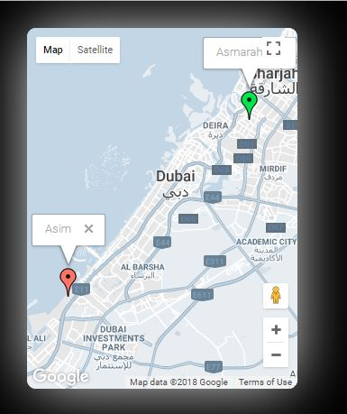

# MMM-TracCar
A [MagicMirror²](https://github.com/MichMich/MagicMirror/) module for tracking moving objects through [Traccar.org](http://www.traccar.org) on a map. A single map (default size: 300x400, can be changed through config settings) is built inside the module, no iframe is used. The best position is bottom left, although it depends upon the user. The map may have nice rounded and shadow borders which adds a nice aesthetic sense to the overall MM. All these settings are adjustable through config settings.

This module is based upon Traccar.org so you must have their server running (you may use their free servers too, if you are  okay with your location saved on their server). For the maps, this module uses Google Maps API. It takes Traccar.org login credentials, server url and Google Maps API key as configuration input.

Upon load, the model initiates contact with the Traccar.org server using HTTP Request. Once contact is successful, it extracts information regarding all the devices that are listed on the server for constant location updates. Then the module formulate a socket connection with the Traccar.org server to receive real-time location updates as and when they are received from the respective devices. Each device is then shown on the map as an individual marker (green for online, red for offline devices) with the respective device name in the popup above each marker. These markers are moved on the map as location updates are received i.e. when a respective device is moving.

The module is built with error handling procedures where it attempts to reconnect with the server after every 15 seconds.



## Using the module

* Navigate to the modules directory via the follow command: `cd MagicMirror/modules`
* Clone the module from github: `git clone https://github.com/asimhsidd/MMM-TracCar.git`
* Navigate to the MMM-TracCar directory: `cd MMM-TracCar`
* Install the dependencies: `npm install`
* Add the following configuration to the modules array in the `config/config.js` file:
```js
    modules: [
        {
			module: 'MMM-TracCar',
			position: 'top_left',
			config: {
				url: "", // Traccar Server URL (free server @ http://demo5.traccar.org )
				username: "", // Traccar Account username (email) (btw, there is a free account option too!) :)
				pass: "", // Traccar Account Password
				gmapid: "", // Google Apps key
				map_width: "300", // width of the map element
				map_height: "400", // height of the map element
				map_border_radius: "10", // border radius of the map element (optional)
				map_shadow_color: "POWDERBLUE", // shadow color of the border element (optional)
			}
        }
    ]
```

## Configuration options for MMM-TracCar

| Option    	| Description
|---------------|-----------
| `position`	| *Required* The position of the screencast window. <br>**Options:** `['bottomRight', 'bottomCenter', 'bottomLeft', 'center',  'topRight', 'topCenter', 'topLeft']` <br>**Type:** `string` <br>**Note:** This module config actual sets the location, not the magic mirror position config.
| `url`  	| *Required* Your url of the Traccar.org server. <br>
| `username`   	| *Required* Your username(email) of the Traccar.org server. <br>
| `pass`   	| *Required* Your password of the Traccar.org server. <br>
| `gmapid`   	| *Required* Your google key. <br>
| `map_width`   	| *Required* Width of the map element. <br>
| `map_height`   	| *Required* Height of the map element. <br>
| `map_border_radius`   	| *Optional* Border radius of the map element. <br>
| `map_shadow_color`   	| *Optional* Shadow color of the border element. <br>
